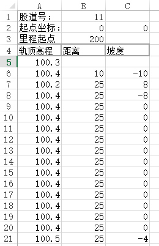
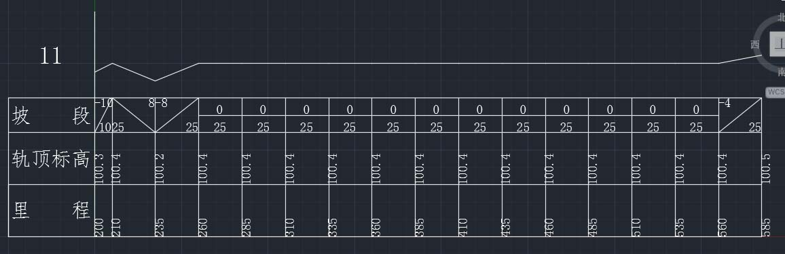

# Survey使用手册
Survey是一个将纵断面测量结果转化为AutoCAD的.dxf格式文件的小软件。

这个软件本身并不能计算和整理测量数据，需要用户按一定格式要求整理好测量数据并保存在Excel文件中。

.dxf文件是AutoCAD的一种开放格式。用户可以使用AutoCAD打开.dxf文件，并另存为AutoCAD的标准格式文件.dwg文件。

## 重要说明

由于AutoCAD默认样式中汉字显示错误（显示“？？”）。建议将样式的字体改成“宋体”或“仿宋”等字体。

## Excel文件格式

Survey是从Excel格式文件中导入测量数据的。Excel目前流行的格式为.xlsx，即Excel2007及其后续版本（2010和2013）使用的格式。较早版本.xls，即Excel2000，甚至更早的Excel97使用的版本也比较多。

Survey使用的是.xlsx格式，.xls实测也能打开。

## 流程

流程很简单，打开存有数据的Excel文件，选择工作表。保存为一个.dxf文件。用AutoCAD打开这个.dxf文件，检查。

## 选项

选项可以设置.dxf文件的各项参数。目前只有高程的比例。

## 高程比例

选项中的高程比例与纵断面图的纵向比例不同。高程比例是纵向的放大倍数。如果按照与横向比例一致的比例绘制纵断面图，图中纵断面线的坡度就不明显。将高程放大，可以明显的看出坡度变化。

## 数据源（Excel文件）

这个软件使用的在Excel文件中已经完成计算的数据。

数据格式如下图所示：

图中的坐标为，纵断面图的左下角在AutoCAD图中的坐标，在绘制多个纵断面图时，可以将不同的图绘制在不同位置上。

## 纵断面图

